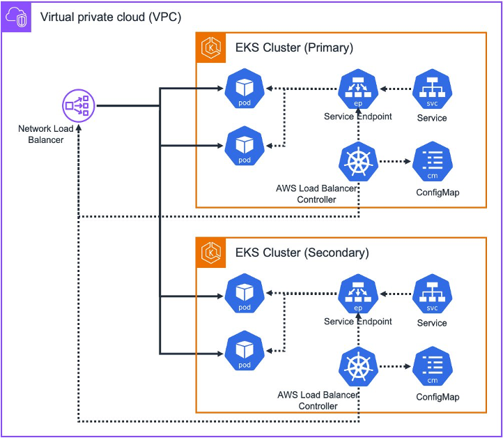

# Design Patterns for building resilient applications across EKS Clusters
## Part 1: NLB Configuration with AWS Load Balancer Controller

### Multi-Cluster Load Balancing in Amazon EKS Using AWS Load Balancer Controller

This guide demonstrates how to implement multi-cluster load balancing in Amazon EKS using the AWS Load Balancer Controller's MultiCluster Target Group feature. 

For complete step-by-step instructions and additional details, please visit our blog at [Design Patterns for building resilient applications across EKS Clusters - Part1](https://aws.amazon.com/blogs/).

### Architecture

This solution covers two key scenarios:

#### Scenario 1: Existing Workloads

- Extending current NLB configuration to support multi-cluster traffic
- Modifying existing TargetGroupBinding for cross-cluster support
- Migrating running applications without downtime

#### Scenario 2: New Deployments

- Setting up fresh deployments with multi-cluster support
- Configuring NLB for cross-cluster traffic distribution
- Implementing shared Target Groups across clusters

#### Prerequisites

- AWS Load Balancer Controller version 2.10 or higher
- Two EKS clusters (Primary and Secondary)
- AWS CLI and kubectl configured
- Appropriate IAM permissions

#### Features Covered

- MultiCluster Target Group configuration
- Cross-cluster load balancing
- Shared TargetGroupBinding
- ConfigMap-based target management

#### Lab Environment

Step-by-step instructions for both scenarios using:

- Amazon EKS
- AWS Load Balancer Controller
- Network Load Balancer
- Nginx as sample application

#### Deploying the solution

For complete step-by-step instructions and additional details, please visit our blog at [Design Patterns for building resilient applications across EKS Clusters - Part1](https://aws.amazon.com/blogs/).
